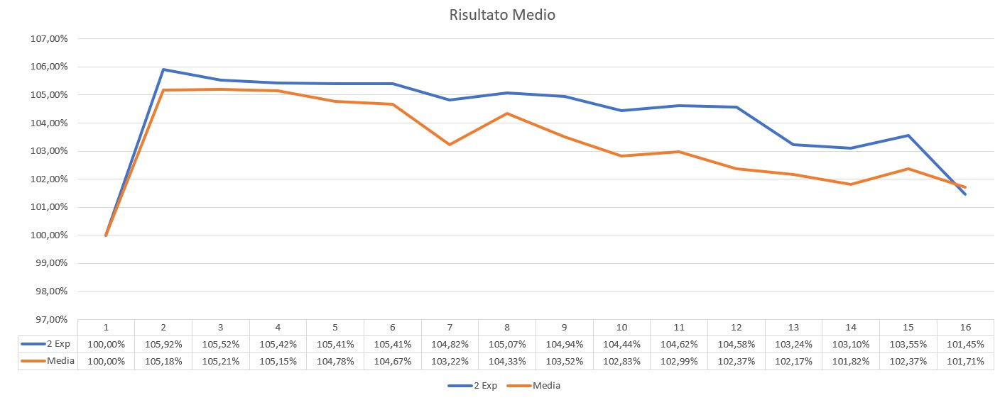

# Conway's Game of life  

###### Sebastiano Caruso PCPC 2018/19

##### Analisi del Problema
Game of Life è un problema che si presta bene alla parallelizzazione. Tuttavia data la natura stessa del problema è di cruciale importanza comprendere subito che in una soluzione parallela, i vari task non sono del tutto indipendenti fra di loro bensì necessitano di comunicare, per ogni ciclo di vita, al fine di mantenere sempre aggiornato il contenuto delle cellule vicine tra di loro.

Nelle fasi iniziali del progetto mi sono concentrato su come strutturare la soluzione da presentare.

È stato chiaro fin da subito che la maggiore concentrazione andava posta sulla tecnica di splitting della matrice iniziale del problema.
Le idee prese in analisi sono state principalmente  le seguenti:

1. Dividere la matrice iniziale in una serie di sotto-matrici, per rendere l'idea, avere una suddivisione simile a quella del sudoku.
2. Dividere la matrice in gruppi di righe, quindi lasciando il numero di colonne intatto anche nelle sotto-matrici.

Dopo una breve analisi ho optato per la seconda tecnica date le difficoltà di gestire in C uno splitting sulle colonne (non memorizzate contiguamente in memoria) e soprattutto considerando che avrei dovuto aggiungere operazioni di invio e ricezione per le colonne confinanti, e quindi esporsi al rischio di avere troppo OVERHEAD di comunicazione.

##### Splitting dell'input

Come detto nel paragrafo precedente la matrice iniziale è stata suddivisa in base alle righe. Nello specifico, viene diviso il numero di righe per il numero di processori che il programma ha a disposizione. Questo ci espone subito a distinguere due casi differenti :
1. Il numero di righe è perfettamente divisibile per il numero di processori: 
```C
if(rem == 0){
  sub_lenMaster = quotient + 1;		
	for(rank = 1; rank < numproc; rank++){
	sub_start[rank] = (rank * quotient) - 1;
	if(rank != numproc - 1){
	  sub_len[rank] = quotient + 2;
	}else{
		sub_len[rank] = quotient + 1;
	}
}
```
In questo caso ogni processore **lavora** esattamente su _quotient_ righe, ma ne riceve 2 in più, che sarebbero la righa prima delle _quotient_ e la riga dopo le _quotient_. In questo modo, comunico ad ogni processore che avrà bisogno di una matrice più grande di _quotient_ righe per lavorare. Fanno eccezione il primo (il master) e l'ultimo processore ai quali tocca la prima e l'ultima porzione di matrice. Questi processori prenderanno una riga in meno dato che non avranno bisogno di ricevere la riga prima delle _quotient_, per il master, e la riga dopo le _quotient_ per l'ultimo processore.
2. Il numero di righe non è perfettamente divisibile per il numero di processori : 
```C
else{
	/*** CASO 2: INPUT NON DIVISIBILE PER NUM PROC ***/
	sub_lenMaster = quotient + 2;
	for(rank = 1; rank < numproc; rank++){
		if(rank < rem){
		/*** I PRIMI REM PROC ***/
		sub_start[rank] = (rank * (quotient+1)) - 1;
		sub_len[rank] = quotient + 3;
		}else{
			if(rank == numproc - 1){
				sub_start[rank] = n -(quotient +1);
				sub_len[rank] = quotient + 1;
			}else{
				sub_start[rank] = ((rem *(quotient+1)) + (((rank-rem)*(quotient)))) - 1;
				sub_len[rank] = quotient + 2;
			}
}
```
In questo caso la divisione tra il numero di righe e il numero di processori non è perfetta e quindi avremo un numero di righe rimanenti (_rem_). La tecnica che ho utilizzato è stata quella di assegnare ai primi _rem_ processori 1 riga in più. Di conseguenza il master lavorerà su _quotient + 2_ righe dato cha avrà 1 riga in più per il _rem_ e una riga in più (l'ultima) per le dinamiche del problema. I successivi _rem - 1_ processori lavoreranno su _quotient + 3_ righe, 2 delle quali rappresentano righe di sola lettura mentre 1 rappresenta la riga del _rem_. In questo modo, i primi _rem_ processori **lavorano** su esattamente _quotient + 1_ righe. Per gli altri processori bisogna calcolare qual è la prima riga non assegnata. La riga di codice che si occupa di farlo è la seguente : 

```C
sub_start[rank] = ((rem *(quotient+1)) + (((rank - rem)*(quotient)))) - 1;
```

I primi _rem_ processori **lavorano** su _quotient + 1_ righe, i successivi _rank-rem_ **lavorano** su _quotient_ righe, quindi la prima riga che non è stata ancora assegnata a nessun processore è proprio data dalla somma di questi due prodotti, siccome ad ogni processore deve essere assegnata una riga di lettura all'inizio per le dinamiche del problema mi "sposto indietro" con il _-1_ . A questo punto all'attuale processore viene inviata l'ultima riga sulla quale **lavora** il processo prima di lui e successivamente altre _quotient_ righe sulle quali **lavorare** più un ulteriore riga di sola lettura. Diverso è il caso in qui il processore in questione è l'ultimo; basta semplicemente partire dall'ultima riga della matrice e prendere le _quotient + 1_ righe precedenti. Ancora una volta, _quotient_ sarranno quelle sulle quali dovrà **lavorare** menre _1_ sarà di sola lettura ( la prima).

Terminata questa fase verrà fatto l'invio delle dimensioni ad ogni singolo slave, utilizzando la funzione MPI_Send(). Lo slave a sua volta provvederà ad istanziare una matrice delle esatte dimensioni che ha ricevuto. Successivamente il master si preoccuperà di inviare ad ogni slave le righe che gli interessano.

##### Calcolo del life cicle
Una volta ricevuti i dati ogni processore è pronto per la computazione del life cicle, ovvero il cuore del programma. Di seguito mostro brevemente come ho implementato questa logica. 
```C
void lifeCicle(char** univ, char** new, int n_row, int n_col, int my_rank, int numproc){
....
if(my_rank == 0){
  /*** HO UNA RIGA IN PIÙ ALLA FINE ***/
	i = 0;
	n_row = n_row - 1;
	for(i; i < n_row; i++){
		for(j = 0; j < n_col; j++){
		  if(i == 0 && j == 0) prox = (int) univ[i][j+1] + (int) univ[i+1][j] +(int) univ[i+1][j+1];
			else if(i == 0 && j != n_col - 1) prox = (int) univ[i][j-1] + (int) univ[i+1][j-1] + (int) univ[i+1][j] + (int) univ[i+1][j+1] + (int) univ[i][j+1];
			else if(i == 0 && j == n_col - 1) prox = (int) univ[i][j-1] + (int) univ[i+1][j-1] + (int) univ[i+1][j];
			else if(i == n_row - 1 && j == 0) prox = (int) univ[i-1][j] + (int) univ[i-1][j+1] + (int) univ[i][j+1] + (int) univ[i+1][j+1] + (int) univ[i+1][j];
			else if(i == n_row - 1 && j == n_col -1) prox = (int) univ[i-1][j] + (int) univ[i-1][j-1] + (int) univ[i][j-1] + (int) univ[i+1][j-1] + (int) univ[i+1][j];
			else if(j == n_col - 1) prox = (int) univ[i-1][j] + (int) univ[i-1][j-1] + (int) univ[i][j-1] + (int) univ[i+1][j-1] + (int) univ[i+1][j];
			else if(j == 0) prox = (int) univ[i-1][j] + (int) univ[i-1][j+1] + (int) univ[i][j+1] + (int) univ[i+1][j+1] + (int) univ[i+1][j];
			else prox = (int) univ[i-1][j] + (int) univ[i-1][j-1] + (int) univ[i][j-1] + (int) univ[i+1][j-1] + (int) univ[i+1][j] + (int) univ[i+1][j+1] + (int) univ[i][j+1] + (int) univ[i-1][j+1];
			
			if(prox < 2 && (int) univ[i][j] == 1) new[i][j] = (char) 0;
			if((prox == 2 || prox == 3) && (int) univ[i][j] == 1 ) new[i][j] = (char)1;
			if(prox > 3) new[i][j] = (char) 0;
			if(prox == 3 && (int) univ[i][j] == 0) new[i][j] = (char) 1;
 		}
	}	
}
```
Questo mostrato è il calcolo del life cicle che interessa solo il master. Ho avuto la necessità di differenziare il calcolo in tre categorie:
1. Master => Ha una riga in più alla fine, di conseguenza deve fermarsi a _n_row - 1_, quindi la riga _n_row_ sarà una riga di sola lettura.
2. Processore intermedio => Ha una riga in più all'inizio e alla fine, quindi ha necessità di partire dalla seconda riga (_i = 1_) e fermarsi ad _n_row - 1_. In questo modo la prima riga (_i = 0_) e l'ultima riga (_n_row_) fungeranno solo da righe di lettura.
3. Ultimo processore => Ha una riga in più all'inizio, quindi la prima riga (_i = 0_) sarà di sola lettura, le restanti righe saranno righe sulle quali effettuare il life cicle.

La serie di _if(---){...} else if(---){...}_ a cascata si è resa necessaria per controllare le situazioni di "bordo" al fine di evitare _segmentation fault_.
La variabile _prox_ serve per calcolare quante "cellule" vive ci sono nelle vicinanze, in particolare viene sommato il contenuto di ogni "cellula" della matrice dato che il contenuto può essere 0 oppure 1.

Durante la computazione della funzione per mantenere consistenti i dati viene usata una matrice di appoggio _new_ che rappresenta il successivo stato di vita del sistema. Alla fine della funzione la matrice _new_ viene copiata in _univ_ che fungerà da risultato per il processore chiamante.

##### Invio dei risultati intermedi
Alla fine di ogni singolo round ogni processore si occupa di inviare solamente la propria prima e la propria ultima riga, rispettivamente, al processore prima di lui ed al processore dopo di lui, eccezion fatta ovviamente per il master, che invia solo la propria ultima riga al processore 1, e per l'ultimo che invia la propria prima riga al processore prima di lui. Ovviamente, ogni processo si preoccuperà di ricevere le righe che gli interessano, e quindi di aggiornare i dati **prima** della computazione del round successivo.
##### Invio finale al master
Una volta che tutti i processori hanno competato i propri round di life cicle (finiscono tutti "insieme" dato l'utilizzo di send e receive bloccanti), si occuperanno di inviare i dati al master, che li posizionerà tutti nella porzione di matrice universale assegnata al processore che ha inviato i dati. 

##### Architettura di comunicazione
Per esemplificare meglio come i processori comunicano tra di loro :


È possibile notare che fra i processori tra loro vicini ho instaurato un canale di comunicazione bi-direzionale. Inoltre ogni processo comunica con il master alla fine della computazione del life cicle. La scelta di questa architettura di comunicazione si rivelerà vincente con i dati di benchmark. Infatti questo tipo di comunicazione riduce il traffico sul Communicator Word, facendo in modo che le operaioni di invio e ricezione non rallentino eccessivamente il tempo di esecuzione.


**N.B. In questa architettura ho omesso la comunicazione che avviene inizialmente tra master ed ogni singolo slave, quindi, per essere precisi anche tra Master e slave c'è un canale di comunicazione bi-direzionale. Non è stato inserito nel grafo in quanto, a differenza della comunicazione fra gli slave, questo tipo di comunicazione viene effettuata poche volte, in particolare 2 volte.**


##### Dettagli Implementativi

Spiegati quelli che sono i punti focali del programma, ora mi concentro su di alcuni dettagli implementativi e sulle funzionalità di MPI utilizzate.

+ La matrice è una matrice di **char** e non di interi. In una prima versione che ho sviluppato ho utilizzato una matrice di interi. Successivamente ho pensato di utilizzare i char, che sono lungi 1 byte, anzichè i 4 degli interi. Il motivo è scontato, ovvero la dimensione in termini di byte delle send è **molto** più piccola, quindi questa modifica ha velocizzato e di molto l'esecuzione del programma. Non ho fatto tanti test e confronti tra le due versioni,  ma in ogni test che ho effettuato la versione che utilizza i char si è comportata **molto** meglio.
+ La matrice viene istanziata **per intero** nel master. Avevo pensato di far generare ad ogni slave la sua porzione di matrice, in modo da risparmiare innanzitutto la comunicazione iniziale e successivamente anche il tempo che il master impiega per generare una matrice grossa (ad esempio una matrice con 80.000 righe). Tuttavia, mi sono reso conto che questa scelta compromettava la riproducibilità della computazione, e di conseguenza il test di correttezza, in quanto, la matrice viene istanziata con la funzione _rand()_.
+ L'azzeramento del seme della funzione _rand()_  non viene effettuato **appositamente** per permettere il test di correttezza. Infatti sarà possibile notare che ogni volta che si lancerà il programma la matrice istanziata (<u>con le stesse dimensioni</u>) sarà identica a quelle delle precedenti esecuzioni. Questo faciliterà il test di correttezza.
+ La dimensione delle colonne è limitata a 4040. Questo perchè, nelle macchine che ho utilizzato, MPI non riesce ad allocare un buffer di sistema abbastanza grande per "ospitare" più elementi. Per aggirare questo ostacolo, ho provato ad utilizzare _MPI_Bsend()_ e ovviamente le funzioni _MPI_Buffer_attach()_ e _MPI_Buffer_detach()_. Il problema è stato risolto in parte. Nel programma vengono effettuate molte send, quindi tramite la _MPI_Buffer_attach()_ avrei dovuto dichiarare un buffer abbastanza grande per soddisfare tutte le send. Tuttavia l'approccio descritto non è stato utilizzato poichè da una lettura della documentazione ho capito che avrei avuto il rischio di rallentare l'esecuzione e di perdere qualche valore. Infatti nelle prove che ho eseguite ho ricevuto output "strani". Probabilmente, anzi sicuramente una soluzione a questo problema c'è, ma non sono stato in grado di trovarla in tempi ragionevoli. Tuttavia, mi ritengo comunque soddisfatto della dimensione dei test che ho effettuato e credo che mostrino per bene i risultati che ho ottenuto. **N.B.** Anche la Ssend permetter di avere buffer leggermente più grandi, nonostante ciò nemmeno questo approccio ha funzionato.
+ Il programma utilizza **_MPI_Abort()_**. Se la dimensione dell'input (in termine di numero di righe) è uguale o addirittura inferiore al numero di processori che ha a disposizione l'esecuzione, o se il quoziente della divisione è 1 (a prescindere da un eventuale resto), il programma termina stampando un messaggio che ne spiega il motivo. Questa limitazione per me ha senso ed è motivata dal fatto che in un caso realistico di utilizzo, al massimo si potrebbe disporre di 256, volendo essere esagerati 512 processori, ebbene con una dimensione di 256 o 512 righe il sequenziale si comporta meglio (o similmente, dipende dal numero di colonne) del parallelo.

##### Test Della correttezza

Per testare la correttezza della soluzione che ho fornito bisogna eseguire la versione sequenziale che io stesso ho implementato. Partendo dal presupposto che la versione sequenziale sia corretta :smile: bisogna semplicemente controllare se le matrici date in output siano identiche. 

Questo è garantito dal fatto che la matrice iniziale generata in modo "random" è identica sia nella versione sequenziale che parallela (**se entrambe le esecuzioni vengono lanciate sulla stessa macchina**). I vincoli, anche se scontati, sono : 

1. L'input del programma deve essere identico ad entrambe le versioni, quindi:
   * Stesso numero di righe
   * Stesso numero di colonne 
   * Stesso numero di round

La stampa della matrice iniziale e finale sono commentate nel codice, di proposito, al fine di evitare di ritrovarsi a stampare matrici esageratamente grandi. Quindi la prego di de-commentare le funzioni stampaMatrice(......) che si trovano sia nel sequenziale che nel parallelo. Le stampe che le interessano sono precedute da _printf("Matrice Iniziale\n");_ e _printf("Matrice Finale\n")_.


##### Compilazione ed esecuzione del programma

Per la scrittura di questo codice non ho utilizzato solamente le librerie:

1. _stdio.h_ : Standard input output.
2. stdlib.h : Libreria di funzioni standard di C
3. _unistd.h_ : Inclusa per la funzione rand()
4. _mpi.h_ : Libreria standard di mpi

Inoltre l'intero codice è stato scritto in un singolo file .c,  per due motivi:

1. Il codice è semplice e a mio avviso non merita l'utilizzo di moduli e/o altro
2. Non volevo inserire dipendenze tipo cmake che potrebbero non essere installate sulle macchine di amazon. La mia è una soluzione pronta all'uso dopo l'installazione di openmpi.

Quindi per compilare il programma basta semplicemente eseguire il comando:

```shell
mpicc paraLife.c -o paraLife
```

Per l'esecuzione invece semplicemente:

```shell
mpirun -np x --hostfile [hostfile] ./paraLife rows cols round
```


dove:

+ x = numero di processori desiderati
+ hostfile è il file dove sono memorizzati gli indirizzi delle macchine del cluster
+ rows = numero di righe
+ cols = numero di colonne
+ round = numero di round


## Benchmark

I test sono stati eseguiti su di un cluster di 8 macchine. La tipologia delle macchine è la t2.large.


##### Strong Scalability


Dalle prime analisi delle prestazioni della soluzione possiamo notare che ha un ottimo comportamento per quanto riguarda il test sulla strong scalability. Per condurre questo test la taglia dell'input è stata fissata a 10.000 righe x 4.040 colonne ed ho effettuato 1000 round di life cicle. È possibile notare come i tempi di esecuzione si abbassano drasticamente già eseguendo la soluzione parallela con due processori. È interessante come si passi da quasi 16 minuti di esecuzione (nel caso del sequenziale) a circa 1 minuto di esecuzione su 16 processori.

Se volessimo tirare le somme qui e fermarci potremmo dire che il nostro algoritmo impiega tanto meno tempo quanti più processori gli forniamo. 

Tuttavia il solo tempo di esecuzione è una metrica di valutazione non sufficiente per giudicare come scala la nostra soluzione. Allora analizziamo cosa succede quando prendiamo in considerazione di quanto effettivamente è lo speedup. Per calcolare questo valore ci affidiamo alla seguente formula : 


dove : 

+ è il tempo di esecuzione del sequenziale
+ N è il numero di processori che abbiamo utilizzato
+  è il numero impiegato con N processori

Il risultato ottenuto è il seguente : 


La linea in arancione rappresenta lo speedup della nostra soluzione. Come possiamo notare passando da 1 a 2 processori la soluzione fornita ha uno speedup del 104 % circa. Quello che normalmente ci si aspetterebbe è che aumentando il numero di processori l'esecuzione sia più veloce, e quindi abbia uno speedup maggiore, ma contrariamente a quanto detto esso diminuisce gradualmente. Il motivo della discesa dello speedup è dovuto al fatto che aumentando il numero di processori aumentiamo sì la potenza computazionale fornita al nostro programma ma aggiungiamo maggiore OVERHEAD di comunicazione. Ovvero aumentando il numero di processori la nostra soluzione impiegherà sempre più tempo per l'invio e la ricezione dei messaggi. ‪È interessante notare che mentra la discesa dello speedup sia linearmente graduale, quando effettuiamo il test con 15 processori abbiamo un picco in discesa. Analizzando questo dato possiamo notare un altro dato interessante all'interno del grafico. 


In questo grafico mostro la differenza tra lo speedup ottenuto dal processore precedente e quello attuale. Es. Speedup ottenuto con 3 - Speedup ottenuto con 4 ---> Valore di 4. Il valore per ogni singolo processore mostra **di quanto** decresce lo speedup. 

Com'è possibile notare, lo speedup decresce  in misura minore quando il numero di processori è pari mentre decresce maggiormente quando il numero di processori è dispari. Questo è dovuto al fatto che essendo la taglia dell'input (10.000 righe) pari, nel caso di processori in numero pari, ci troviamo nella situazione in cui non ci sono righe di reminder ed ogni processore lavora sulla stessa taglia, diversamente invece quando il numero di processori è dispari. Un altro dato interessenta è che le uniche due situazioni (escludendo il passaggio ovvio da 1 a 2 core) in cui lo speed cresce è con 8 processori e con 16. Posso affermare quindi che la mia soluzione si comporta meglio nel caso in cui la taglia dell'input è perfettamente divisibile con il numero dei processori. 

Al fine di controllare la veriticità del primo test, ho effettuato un altro test, questa volta su dimensioni minori (5000x4040 1000 (round)). I risultati ottenuti sono stati molto simili, ad eccezione di pochi valori leggermente in controtendenza. Per praticità mostro un grafico che mette in evidenza l'andamento dello speedup in quest'ultimo test e l'andamento medio fra i due esperimenti :



Da questo risultato, viene confermato che il compromesso migliore tra numero di processori e speedup ottenuto si ottiene ad 8 processori, mentre viene smentito l'aumento dello speedup con 16 processori. Sarebbe interessante effettuare ulteriori esperimenti per verificare se le migliori prestazioni si hanno quando il numero di processori è una potenza di 2 o meno.

Come ultima osservazione vorrei dire che basandosi sulla formula del calcolo dello speedup che ho mostrato, emerge che lo speedup perfetto si verifica quando è soddisfatta la seguente condizione per ogni processo :


Controlliamo i nostri risultati :

| #CPU                          |  1   |  2   |  3   |  4   |  5   |  6   |  7   |  8   |  9   |  10  |  11  |  12  |  13  |  14  |  15  |  16  |
| ----------------------------- | :--: | :--: | :--: | :--: | :--: | :--: | :--: | :--: | :--: | :--: | :--: | :--: | :--: | :--: | :--: | :--: |
|  |  1   |  2   |  3   |  4   |  5   |  6   |  7   |  8   |  9   |  10  |  11  |  12  |  13  |  14  |  15  |  16  |

**N.B. I risultati sono arrotondati. Il motivo per cui la divisione non è perfetta è dovuta al margine di errore che c'è sul calcolo dei tempi, infatti mentre per il parallelo si utilizza MPI_Wtime() per il sequenziale si prendono i tempi con clock_t. Nonostante ciò nessuno dei valori decimali di questo calcolo superava lo 0.4**


##### Weak Scalability


Prima di discutere di questo test è necessario fare una piccola premessa. Per meglio mostrare i risultati ottenuti i dati relativi al tempo di esecuzione sono stati arrotondati per eccesso. Di seguito riporto, per correttezza, i tempi reali ottenuti : 

| #CPU         |    1     |    2     |    3     |    4     |    5    |    6     |    7     |    8     |    9     |    10    |    11    |    12    |    13    |    14    |    15    |    16    |
| ------------ | :------: | :------: | :------: | :------: | :-----: | :------: | :------: | :------: | :------: | :------: | :------: | :------: | :------: | :------: | :------: | :------: |
| **Time (s)** | 117,7598 | 111,7898 | 112,2539 | 112,1884 | 112,652 | 112,9969 | 112,4504 | 113,4974 | 113,2629 | 111,5822 | 113,4923 | 114,1907 | 113,9275 | 114,4165 | 116,2936 | 115,9559 |

Il test è stato effettuato impostando come dimensione per il singolo core 5002 x 1000 eseguendo 1000 round. Per quanto riguarda il sequenziale le dimensioni che sono state utilizzate sono quelle sopra indicate. Successivamente per gli altri test il numero di righe è stato 5000 x N(numero di processori). Ho fatto questa scelta poichè quando la matrice viene splittata nel parallelo, mediamente, ogni processore riceve due righe in più, quindi per ottenere un dato "statistico" più realistico.

Per questa tipologia, lo scaling perfetto si ottiene quando il tempo di esecuzione rimane inalterato per ogni test. Dall'analisi del grafico che ho mostrato si evince che la mia soluzione presenta una leggera varianza del tempo di esecuzione, che varia da 112 a 116 secondi. L'algoritmo sequenziale impiega nettamente più tempo di quello parallelo. Questa differenza credo sia dovuta innanzitutto alle tecniche di ottimizzazione che effettua mpi, a discapito del classico compilatore gcc, ed inoltre anche alla metodologia di cronometraggio, di cui ho parlato prima. 

L'obiettivo di questa tipologia di test è quella di misurare quanto la soluzione in questione utilizzi operazioni di lettura/scrittura dalla memoria. Di conseguenza, lo scaling perfetto, indica che le operazioni di accesso alla memoria non influiscono sui tempi di computazione. Nel mio caso, ricordo, che ogni processo, al lancio, deve ricevere la porzione di matrice e memorizzarla. In particolare, il master deve preoccuparsi di generare la matrice al lancio del programma e di ricomporre i risultati alla fine dell'esecuzione. Quindi, il mio programma deve necessariamente fare operazioni di memoria. Anche per questo motivo avevo pensato di far generare in modo random la propria porzione di matrice ad ogni singolo slave, ma ancora, questo avrebbe compromesso il test di correttezza.

Nonostante tutto, vorrei far notare che le differenze di tempistiche sono realmente "basse" e dovute leggermente anche all'OVERHEAD di comunicazione, quindi mi sento comunque soddisfatto dei risultati ottenuti. 

Per lo stesso discorso fatto nel paragrafo precedente, il mero cronometrare i tempi di esecuzione non basta per analizzare lo scaling del programma. Per questo motivo, anche in questo caso, utilizzeremo lo speedup, ottenuto da questa formula : 


dove, come prima :

+  è il tempo di esecuzione del sequenziale
+  è il tempo di esecuzione con N processori

Il risultato ottenuto è il seguente : 


Come prima, la linea arancione rappresenta lo speedup ottenuto. Per meglio mostrare i risultati ottenuti ho arrotondato per difetto i valori dello speedup. 

Come si evince dal grafico l'andamento dello speedup è costante fino al caso in cui ci sono 5 processori, da 6 a 10 processori abbiamo un comportamento altalenante. In questo caso cominciano a pesare le scritture della matrice (quella finale nel master) in memoria e l'OVERHEAD di comunicazione, tuttavia controllando i valori si ha un andamento altalenante dell'1%, quindi come detto prima mi sembra un risultato soddisfacente. 

Come per la Strong Scalability anche qui ho effettuato un secondo test e fatto la media dei risultati ottenuti. Questa volta le dimensioni per ogni singolo core sono rimaste inalterate dato che aumentarle avrebbe rallentato troppo l'esecuzione di ogni test. Osserviamo i risultati :


L'andamento del secondo esperimento è molto in linea con i risultati del primo, infatti il valore medio dello speedup si discosta poco dai singoli valori del secondo esperimento. Questa volta però in controtendenza con il secondo esperimento ad 8 processori ho ottenuto un risultato migliore, infatti è l'unico punto in cui lo speedup aumenta considerevolmente.

In conclusione osservando la distribuzione media, ancora una volta si ripete il dato interessante che vede i casi in cui il numero di processori sia pari ottenere delle prestazioni migliori (cali minori di prestazioni). Questo conferma quanto affermato nella precedente sezione.

#####  
​    
​    
​    
​    
​    

